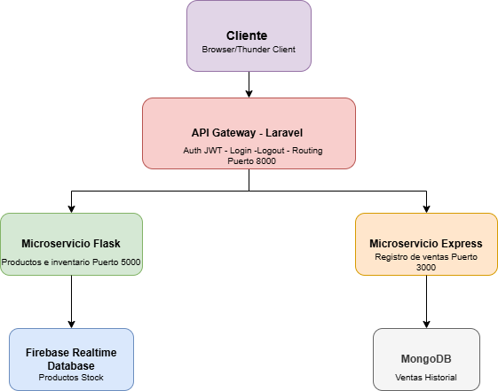

# 🛒 Sistema de Ventas — Arquitectura de Microservicios

Sistema de registro de ventas construido con una arquitectura basada en microservicios, donde todas las solicitudes del cliente pasan por un API Gateway central.

---

## 🏗️ Arquitectura del Sistema

El sistema está compuesto por tres servicios independientes:

| Servicio | Tecnología | Puerto | Responsabilidad |
|---|---|---|---|
| api_gateway | Laravel | 8000 | Autenticación JWT, enrutamiento de solicitudes |
| api_flask | Flask + Firebase | 5000 | Gestión de productos e inventario |
| api_express | Express + MongoDB | 3000 | Registro y consulta de ventas |

El cliente **nunca se comunica directamente** con los microservicios. Toda solicitud entra por el Gateway, que valida el JWT y redirige al microservicio correspondiente.

```
Cliente
  │
  ▼
API Gateway (Laravel :8000)
  │
  ├──► api_flask (Flask :5000) ──► Firebase Realtime Database
  │
  └──► api_express (Express :3000) ──► MongoDB
```

---

## ⚙️ Requisitos

- PHP >= 8.1 + Composer
- Python >= 3.10 + pip
- Node.js >= 18 + npm
- MySQL
- MongoDB
- Cuenta de Firebase con Realtime Database habilitada

---

## 🚀 Instalación y Configuración

### 1. API Gateway — Laravel

```bash
cd api_gateway
composer install
cp .env.example .env
php artisan key:generate
php artisan jwt:secret
```

Configura las variables de entorno en `.env`:

```env
DB_CONNECTION=mysql
DB_HOST=127.0.0.1
DB_PORT=3306
DB_DATABASE=api_gateway
DB_USERNAME=root
DB_PASSWORD=tu_password

MS_INVENTARIO_URL=http://localhost:5000
MS_VENTAS_URL=http://localhost:3000
```

Corre las migraciones y el seeder:

```bash
php artisan migrate
php artisan db:seed
```

Inicia el servidor:

```bash
php artisan serve
```

---

### 2. ms-inventario — Flask

```bash
cd api_flask
python -m venv venv
pip install -r requirements.txt
```
Activa el entorno virtual:
```bash
# Windows
venv\Scripts\activate

# Linux / Mac
source venv/bin/activate
```

Configura las credenciales de Firebase en el archivo correspondiente y luego inicia el servidor:

```bash
python app.py
```

---

### 3. ms-ventas — Express

```bash
cd api_express
npm install
```

Configura la conexión a MongoDB en `.env`:

```env
MONGO_URI=mongodb://localhost:27017/ms_ventas
PORT=3000
```

Inicia el servidor:

```bash
node server.js
```

---

## 🔐 Autenticación

El sistema usa **JWT (JSON Web Token)** para proteger los endpoints. El flujo es:

1. El cliente hace `POST /api/login` con sus credenciales.
2. El Gateway valida las credenciales y retorna un `access_token`.
3. El cliente incluye el token en el header de cada solicitud: `Authorization: Bearer {token}`.
4. El Gateway valida el token antes de redirigir la solicitud al microservicio correspondiente.

**Usuario por defecto (seeder):**

| Campo | Valor |
|---|---|
| Email | admin@gateway.com |
| Password | password123 |

---

## 📡 Endpoints

Todos los endpoints (excepto login) requieren el header:
```
Auth desde Thunder Client: Bearer {token}
```

### Auth

| Método | Endpoint | Descripción | Auth |
|---|---|---|---|
| POST | `/api/login` | Iniciar sesión y obtener token JWT | ❌ |
| POST | `/api/logout` | Cerrar sesión e invalidar token | ✅ |
| GET | `/api/me` | Obtener datos del usuario autenticado | ✅ |

**POST /api/login — Body:**
```json
{
  "email": "admin@gateway.com",
  "password": "password123"
}
```

**Respuesta:**
```json
{
  "access_token": "eyJ...",
  "token_type": "bearer",
  "expires_in": 3600,
  "user": { "id": 1, "name": "Admin", "email": "admin@gateway.com" }
}
```

---

### Inventario (ms-inventario → Flask :5000)

| Método | Endpoint | Descripción |
|---|---|---|
| GET | `/api/inventario/products` | Listar todos los productos |
| POST | `/api/inventario/products` | Registrar un nuevo producto |
| GET | `/api/inventario/products/{id}` | Verificar stock de un producto |
| PUT | `/api/inventario/products/{id}` | Actualizar stock de un producto |

**POST /api/inventario/products — Body:**
```json
{
  "name": "Camisa azul",
  "price": 45000,
  "stock": 17
}
```

**Respuesta:**
```json
{
  "id": "-Oni8hZItSlvV1eIM56r",
  "name": "Camisa azul"
}
```

**GET /api/inventario/products/{id} — Respuesta:**
```json
{
  "id": "-Oni8hZItSlvV1eIM56r",
  "name": "Camisa azul",
  "price": 45000,
  "stock": 17,
  "available": true
}
```

**PUT /api/inventario/products/{id} — Body:**
```json
{
  "amount": 3
}
```

**Respuesta:**
```json
{
  "id": "-Oni8hZItSlvV1eIM56r",
  "name": "Camisa azul",
  "message": "Stock updated successfully",
  "previous_stock": 17,
  "new_stock": 14
}
```

---

### Ventas (ms-ventas → Express :3000)

| Método | Endpoint | Descripción |
|---|---|---|
| POST | `/api/ventas` | Registrar una nueva venta |
| GET | `/api/ventas` | Listar todas las ventas |
| GET | `/api/ventas/fecha?start=&end=` | Consultar ventas por rango de fechas |
| GET | `/api/ventas/usuario/{usuario_id}` | Consultar ventas por usuario |

**POST /api/ventas — Body:**
```json
{
  "usuario_id": "1",
  "productos": [
    { "id": "-Oni8hZItSlvV1eIM56r", "cantidad": 3 }
  ],
  "total": 135000
}
```

**Respuesta:**
```json
{
  "message": "Sale registered successfully",
  "id": "69b62722c9964cabe3ebc336"
}
```

**GET /api/ventas/fecha — Query params:**
```
?start=2026-01-01&end=2026-12-31
```

---

## 🔄 Flujo de Registro de una Venta

Cuando el cliente hace `POST /api/ventas`, el Gateway orquesta el siguiente flujo:

```
1. Cliente envía POST /api/ventas con JWT
         │
         ▼
2. Gateway valida el token JWT
         │
         ▼
3. Por cada producto en la solicitud:
   Gateway consulta GET /api/products/{id} en ms-inventario
         │
         ├── Stock insuficiente ──► 422 Stock insuficiente
         └── Stock OK ──► continúa
         │
         ▼
4. Gateway enriquece los datos del producto
   (agrega nombre y precio obtenidos desde ms-inventario)
         │
         ▼
5. Gateway envía POST /sales a ms-ventas con los datos completos
         │
         ├── Error en Express ──► 502 Error al registrar la venta
         └── Venta registrada ──► continúa
         │
         ▼
6. Por cada producto:
   Gateway envía PUT /api/products/{id} a ms-inventario
   para descontar el stock vendido
         │
         ▼
7. Gateway retorna la respuesta de éxito al cliente
```

---

## 🗂️ Estructura del Proyecto

```
sistema-ventas/
├── api-gateway/          # Laravel — API Gateway
│   ├── app/
│   │   ├── Http/
│   │   │   └── Controllers/
│   │   │       ├── AuthController.php
│   │   │       └── GatewayController.php
│   │   └── Models/
│   │       └── User.php
│   ├── database/
│   │   └── seeders/
│   │       └── UserSeeder.php
│   └── routes/
│       └── api.php
│
├── api_flask/        # Flask — Microservicio de Inventario
│   ├── app.py
│   ├── config.py
│   ├── models.py
│   └── routes.py
│
└── api_express/            # Express — Microservicio de Ventas
    ├── server.js
    ├── models/
    │   └── Sale.js
    └── routes/
        └── sales.js
```

---

## 🧩 Diagrama de Arquitectura



## 👤 Autor

Sergio Alejandro Gaitán Quintero
